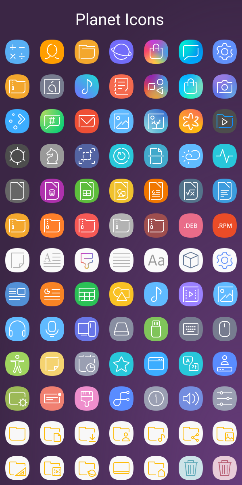
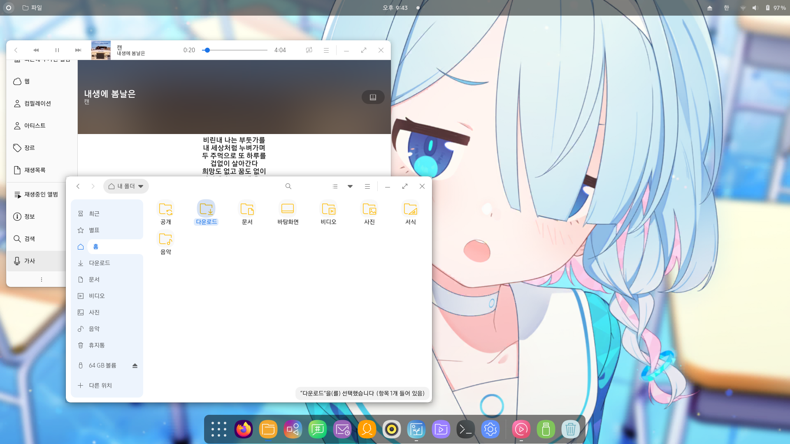
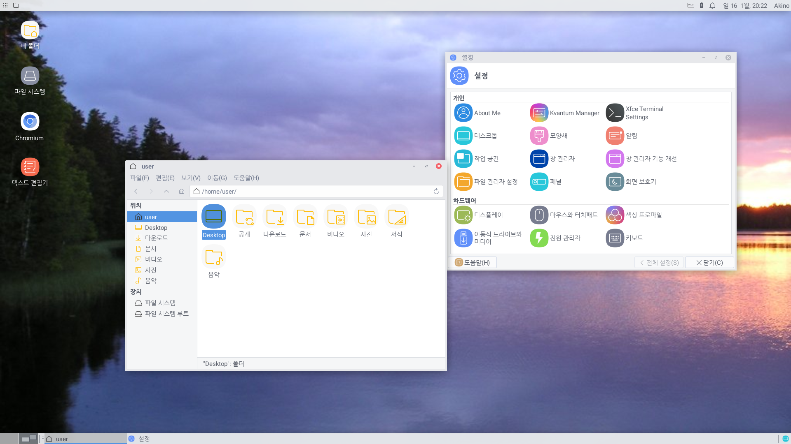

# Planet-icons
Samsung Experience Style Icons for Linux

# Based On
* OneUI-Icons
* [Fluent-icon-theme by vinceliuice](https://github.com/vinceliuice/Fluent-icon-theme)

# Varients

All Varients need Planet Icons.

 - Planet Dream : Galaxy S8 Version
 - Planet Colors : with KDE Color Scheme

# Preview

# Sample
* GNOME

* KDE

* Cinnamon

* Xfce

